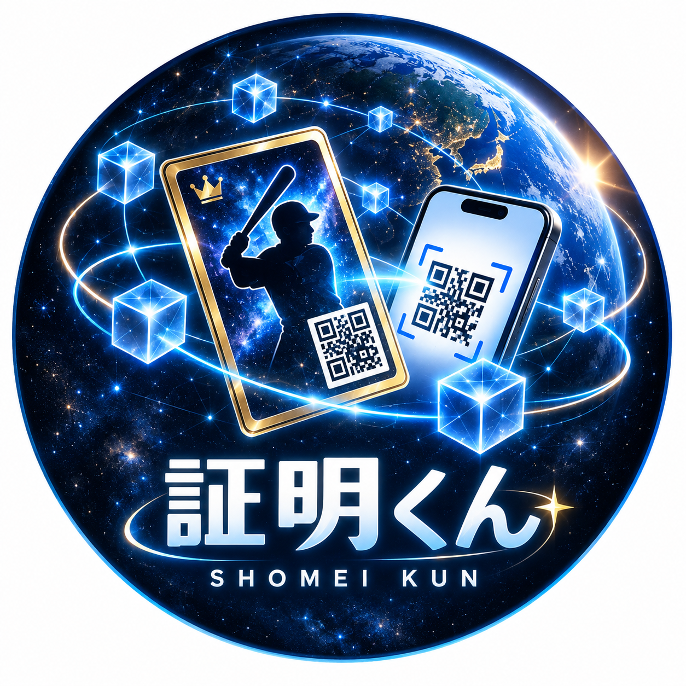
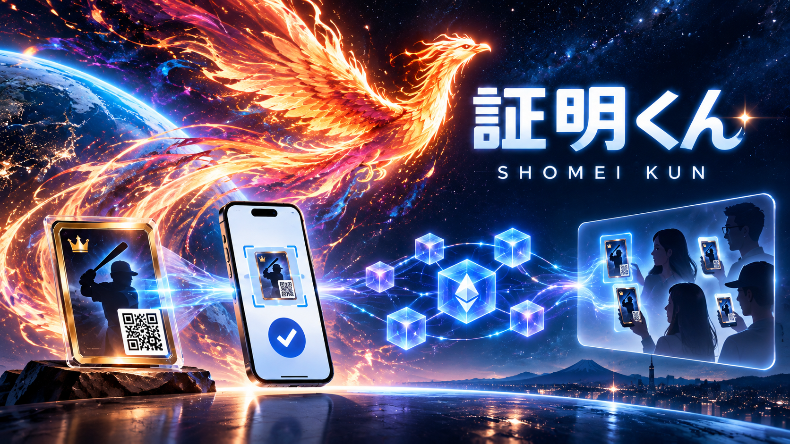

English | [日本語](README.ja.md)

  

# Shomei-kun QR Proof

Find card registrations by QR, ENS name, or wallet address.

## Overview

Shomei-kun QR Proof lets you scan a card's QR code to see which wallet it is registered to. The demo uses a trading card featuring Shomei Ichiro, a fictional baseball player, to show how an owner registers a card and how someone else checks the record.

QR scanning is the main entry point. You can also search by ENS name or wallet address. If the card is unregistered, enter a nickname and approve the registration in MetaMask. If it is already registered, the app shows its registered owner and transaction details. Viewing a record does not require a wallet connection. The interface supports Japanese and English.

ENS names resolve on Sepolia; card records remain on Curvegrid Testnet. Search `shomeikun.eth` to see its wallet's registered cards, then open a card's registration record. The registration screen also shows a connected wallet's Primary name when reverse and forward resolution agree. Names are display labels; ownership and permissions remain address-based.

The card ID, the registering wallet address, and the nickname are recorded on the blockchain. Anyone can return to the record through the same QR code. This demo supports one-time registration, with no editing, deletion, or ownership transfer after registration.

The record links a card ID to a registered wallet. It does not prove physical possession, card authenticity, legal ownership, or a person's real identity. A copied QR code displays the same record.

## How to use it

1. Scan the card's QR code.
2. If the card is unregistered, enter a public nickname and approve the registration transaction in your MetaMask wallet.
3. After registration, scan the same QR code to view the registered owner and record.

- [Testnet demo](https://shomei-kun-integration.dptr.workers.dev/ui/): registration requires an issued, unregistered card and a wallet with funds for testnet gas.
- [UI demo](https://shomei-kun-ui-mock.dptr.workers.dev/): explore the screens with sample data. No actual registration or transfers take place.

On iPhone and iPad, register through MetaMask's built-in browser. Nicknames and wallet addresses are public, so do not include personal information in your nickname.

## Screenshots

Screenshots of the English interface.

| Screen | Image |
| --- | --- |
| Home | [View](docs/submission/2026-09-26/screenshots/01-home-en.png) |
| QR scan | [View](docs/submission/2026-09-26/screenshots/02-qr-scan-en.png) |
| Unregistered card | [View](docs/submission/2026-09-26/screenshots/03-unregistered-card-en.png) |
| Owner information | [View](docs/submission/2026-09-26/screenshots/04-owner-information-en.png) |
| Registration review | [View](docs/submission/2026-09-26/screenshots/05-review-en.png) |
| Wallet approval | [View](docs/submission/2026-09-26/screenshots/06-wallet-approval-en.png) |
| Registration in progress | [View](docs/submission/2026-09-26/screenshots/07-registration-progress-en.png) |
| Registration complete | [View](docs/submission/2026-09-26/screenshots/08-registration-complete-en.png) |
| Record details | [View](docs/submission/2026-09-26/screenshots/09-record-details-en.png) |
| ENS and address search | [View](docs/submission/2026-09-26/screenshots/10-ens-search-en.png) |
| Live registered cards | [View](docs/submission/2026-09-26/screenshots/11-ens-results-en.png) |
| Live card record | [View](docs/submission/2026-09-26/screenshots/12-live-record-en.png) |

## Existing project and this implementation

This project builds on the ideas behind [Shomei-kun, a Tennchiai Project initiative](https://tennchiai.com/). The existing project aims to let people register their own records and later check their origin and history.

Here, we apply that approach to physical cards, QR codes, and wallet-based registration. This repository contains an independent reference implementation and demo. We have not imported the existing PoC's source code or user data.

| Scope | Work |
| --- | --- |
| Pre-existing work | The Shomei-kun concept, photo and video registration, album management, visibility settings, sharing through URLs, and the use of blockchain as external evidence |
| Developed in this repository | Card ID issuance, QR reading, wallet-based owner registration, nickname recording, public record viewing, Japanese and English UI, QR reading through the camera or photos, unrestricted issuance, ENS/address search, and verified Primary name display |

The description of existing features is based on materials provided by the project. See [pre-existing work](specs/PRE_EXISTING_WORK.md) for sources and reuse details, and the [development log](specs/HACKATHON_CHANGES.md) for implementation and verification records.

## ETHGlobal Tokyo 2026

This project is being prepared for the Continuity track. Following the [official rules](https://ethglobal.com/events/tokyo2026/info/details), we document pre-existing work separately from new functionality. The development log and commit history identify the work carried out during the hackathon. Work whose timing has not been verified is not claimed as hackathon-period work.

Continuity includes "Extend Open Source" and "Ship a Feature." The specific category and eligibility for each partner prize will be checked at submission.

## Implementation and development records

The UI uses JavaScript, Tailwind CSS, and daisyUI. The API uses Next.js and Cloudflare Workers. Registration uses Solidity, Curvegrid MultiBaas, and MetaMask. ENS resolution uses ethers 6.17.0 on Sepolia. The connected demo has been tested on Curvegrid Testnet. See the [registration demo record](specs/OPEN_REGISTRATION_DEMO.md) for environment details and verification results.

- [Specification](specs/SPEC.md), [architecture](specs/ARCHITECTURE.md), and [demo guide](specs/DEMO.md)
- [Run the UI locally](prototypes/mobile-ui/README.md), [API](apps/web/README.md), and [contracts](contracts/README.md)
- [Spec-driven development artifacts](openspec/) and [prompt records](docs/prompts/README.md)

Team members defined requirements and reviewed screen layouts, wording, and assets. AI assisted with image generation, implementation, testing, and documentation. [Prompt report 1](docs/prompts/asagohann777-prompt-report-1-2026-09-26.md) records how people reviewed and corrected AI proposals. The [development log](specs/HACKATHON_CHANGES.md) records work and verification by file.

## Assets and license

UI backgrounds, logos, and card artwork were provided by [Ojiichan Konbini, @asagohann777 on GitHub](https://github.com/asagohann777). See the [asset inventory](specs/assets/asagohann777/README.md) and the [submission icon and cover manifest](docs/submission/2026-09-26/branding/manifest.json).

The source code in this repository is released under the [MIT License](LICENSE). This code license does not cover the supplied artwork and logos or the existing Shomei-kun project. Dependencies retain their respective licenses.
